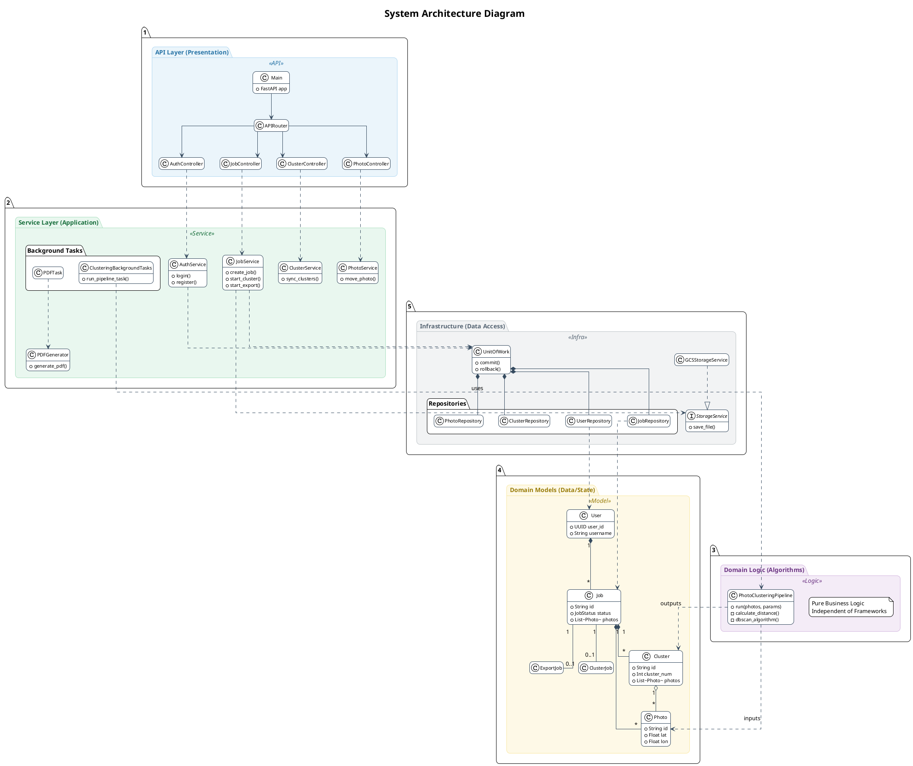

```plantuml
@startuml
!theme plain
hide empty members
skinparam linetype ortho
skinparam shadowing false
skinparam roundcorner 15
skinparam backgroundColor white

' --- Styling ---
skinparam class {
    BackgroundColor White
    ArrowColor #34495E
    BorderColor #34495E
    FontSize 12
    AttributeFontSize 11
    MethodFontSize 11
}

skinparam package {
    BackgroundColor<<API>> #EBF5FB
    BorderColor<<API>> #AED6F1
    FontColor<<API>> #2874A6

    BackgroundColor<<Service>> #E9F7EF
    BorderColor<<Service>> #A9DFBF
    FontColor<<Service>> #196F3D

    BackgroundColor<<Logic>> #F4ECF7
    BorderColor<<Logic>> #D2B4DE
    FontColor<<Logic>> #6C3483

    BackgroundColor<<Model>> #FEF9E7
    BorderColor<<Model>> #F9E79F
    FontColor<<Model>> #9A7D0A

    BackgroundColor<<Infra>> #F2F3F4
    BorderColor<<Infra>> #BDC3C7
    FontColor<<Infra>> #566573
}

title System Architecture Diagram

' ==========================================
' 1. Presentation Layer (API)
' ==========================================
package "1. API Layer (Presentation)" <<API>> {
    class Main {
        +FastAPI app
    }
    class APIRouter

    class AuthController
    class JobController
    class ClusterController
    class PhotoController

    Main --> APIRouter
    APIRouter --> AuthController
    APIRouter --> JobController
    APIRouter --> ClusterController
    APIRouter --> PhotoController
}

' ==========================================
' 2. Application Layer (Services)
' ==========================================
package "2. Service Layer (Application)" <<Service>> {
    class AuthService {
        +login()
        +register()
    }
    class JobService {
        +create_job()
        +start_cluster()
        +start_export()
    }
    class ClusterService {
        +sync_clusters()
    }
    class PhotoService {
        +move_photo()
    }
    class PDFGenerator {
        +generate_pdf()
    }

    package "Background Tasks" {
        class PDFTask
        class ClusteringBackgroundTasks {
            +run_pipeline_task()
        }
    }
}

' ==========================================
' 3. Domain Logic Layer (Core Rules)
' ==========================================
package "3. Domain Logic (Algorithms)" <<Logic>> {
    note "Pure Business Logic\nIndependent of Frameworks" as N1

    class PhotoClusteringPipeline {
        +run(photos, params)
        -calculate_distance()
        -dbscan_algorithm()
    }
}

' ==========================================
' 4. Domain Model Layer (Entities)
' ==========================================
package "4. Domain Models (Data/State)" <<Model>> {
    class User {
        +UUID user_id
        +String username
    }

    class Job {
        +String id
        +JobStatus status
        +List~Photo~ photos
    }

    class Photo {
        +String id
        +Float lat
        +Float lon
    }

    class Cluster {
        +String id
        +Int cluster_num
        +List~Photo~ photos
    }

    class ExportJob
    class ClusterJob

    ' Entity Relationships
    User "1" *-- "*" Job
    Job "1" *-- "*" Photo
    Job "1" *-- "*" Cluster
    Cluster "1" o-- "*" Photo
    Job "1" -- "0..1" ExportJob
    Job "1" -- "0..1" ClusterJob
}

' ==========================================
' 5. Infrastructure Layer
' ==========================================
package "5. Infrastructure (Data Access)" <<Infra>> {
    interface StorageService {
        +save_file()
    }
    class GCSStorageService

    class UnitOfWork {
        +commit()
        +rollback()
    }

    package Repositories {
        class UserRepository
        class JobRepository
        class ClusterRepository
        class PhotoRepository
    }

    UnitOfWork *-- UserRepository
    UnitOfWork *-- JobRepository
    UnitOfWork *-- ClusterRepository
    UnitOfWork *-- PhotoRepository
    GCSStorageService ..|> StorageService
}

' ==========================================
' Cross-Layer Connections
' ==========================================

' Controller -> Service
AuthController ..> AuthService
JobController ..> JobService
ClusterController ..> ClusterService
PhotoController ..> PhotoService

' Service -> Logic
ClusteringBackgroundTasks ..> PhotoClusteringPipeline : uses
PDFTask ..> PDFGenerator

' Service -> Infra
JobService ..> StorageService
AuthService ..> UnitOfWork
JobService ..> UnitOfWork

' Logic -> Model (Logic manipulates Models)
PhotoClusteringPipeline ..> Photo : inputs
PhotoClusteringPipeline ..> Cluster : outputs

' Infra -> Model (Repos manage Models)
UserRepository ..> User
JobRepository ..> Job

@enduml
```
