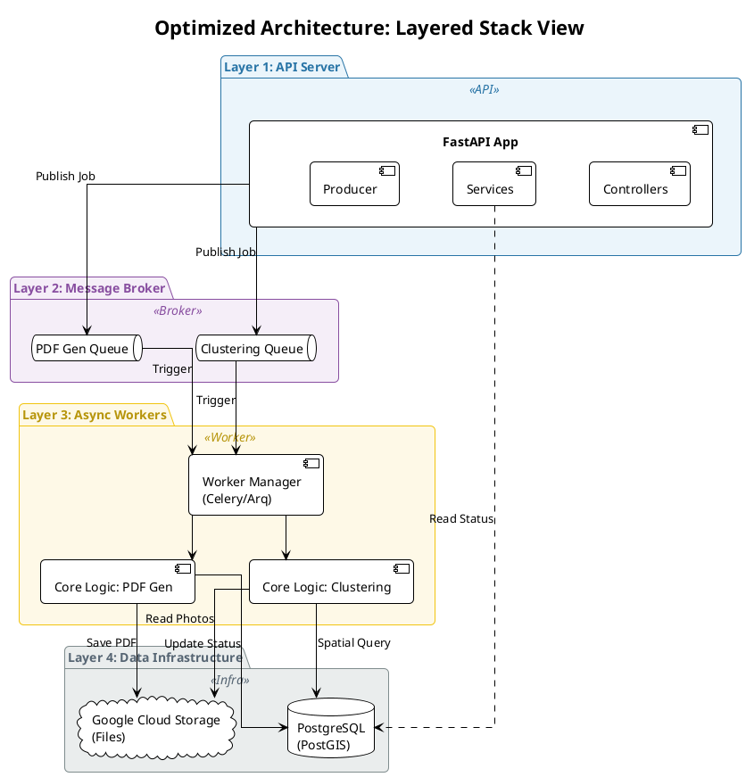

```plantuml
@startuml
!theme plain
hide empty members

' --- 1. Layout & Styling ---
' 위에서 아래로 흐르도록 변경 (이게 겹침 해결의 핵심입니다)
top to bottom direction

skinparam linetype ortho
skinparam shadowing false
skinparam roundcorner 10
skinparam backgroundColor white

' 간격 설정 (충분히 넓게)
skinparam nodesep 60
skinparam ranksep 50

' 박스 스타일링
skinparam package {
    BackgroundColor<<API>> #EBF5FB
    BorderColor<<API>> #2874A6
    FontColor<<API>> #2874A6

    BackgroundColor<<Broker>> #F5EEF8
    BorderColor<<Broker>> #884EA0
    FontColor<<Broker>> #884EA0

    BackgroundColor<<Worker>> #FEF9E7
    BorderColor<<Worker>> #F1C40F
    FontColor<<Worker>> #B7950B

    BackgroundColor<<Infra>> #EAEDED
    BorderColor<<Infra>> #7F8C8D
    FontColor<<Infra>> #566573
}

title "Optimized Architecture: Layered Stack View"

' ==========================================
' Layer 1: API (Entry Point)
' ==========================================
package "Layer 1: API Server" <<API>> {
    component "FastAPI App" as API_App {
        component "Controllers"
        component "Services"
        component "Producer"
    }
}

' ==========================================
' Layer 2: Message Broker (Async Buffer)
' ==========================================
package "Layer 2: Message Broker" <<Broker>> {
    ' 큐 두 개를 나란히 배치하기 위해 together 사용
    together {
        queue "Clustering Queue" as Q1
        queue "PDF Gen Queue" as Q2
    }
}

' ==========================================
' Layer 3: Workers (Compute)
' ==========================================
package "Layer 3: Async Workers" <<Worker>> {
    component "Worker Manager\n(Celery/Arq)" as Consumer

    ' 로직 두 개를 나란히 배치
    together {
        component "Core Logic: Clustering" as Logic_Cluster #White
        component "Core Logic: PDF Gen" as Logic_PDF #White
    }
}

' ==========================================
' Layer 4: Infrastructure (Data Sink)
' ==========================================
package "Layer 4: Data Infrastructure" <<Infra>> {
    database "PostgreSQL\n(PostGIS)" as DB
    cloud "Google Cloud Storage\n(Files)" as Storage
}

' ==========================================
' Relationships
' ==========================================

' 1. API -> Broker
API_App --> Q1 : Publish Job
API_App --> Q2 : Publish Job

' 2. Broker -> Worker
Q1 --> Consumer : Trigger
Q2 --> Consumer : Trigger

' 3. Consumer -> Logic
Consumer -down-> Logic_Cluster
Consumer -down-> Logic_PDF

' 4. Workers -> Infra
Logic_Cluster --> DB : Spatial Query
Logic_Cluster --> Storage : Read Photos

Logic_PDF --> Storage : Save PDF
Logic_PDF --> DB : Update Status

' 5. API -> Infra (Side connection)
' API에서 DB로 가는 선이 다른 박스를 뚫지 않게 배치됨
Services ..> DB : Read Status

' --- Layout Helpers (강제 정렬) ---
' 계층 순서를 명확하게 지정하여 레이아웃 엔진 혼동 방지
API_App -[hidden]down-> Q1
Q1 -[hidden]down-> Consumer
Logic_Cluster -[hidden]down-> DB

@enduml
```
